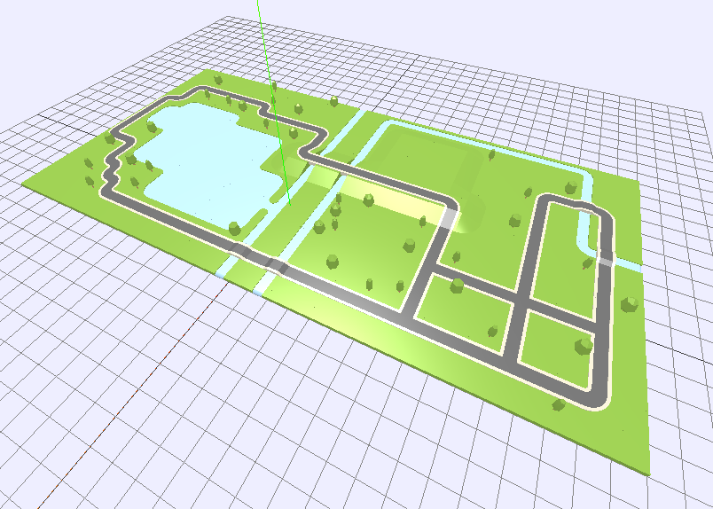
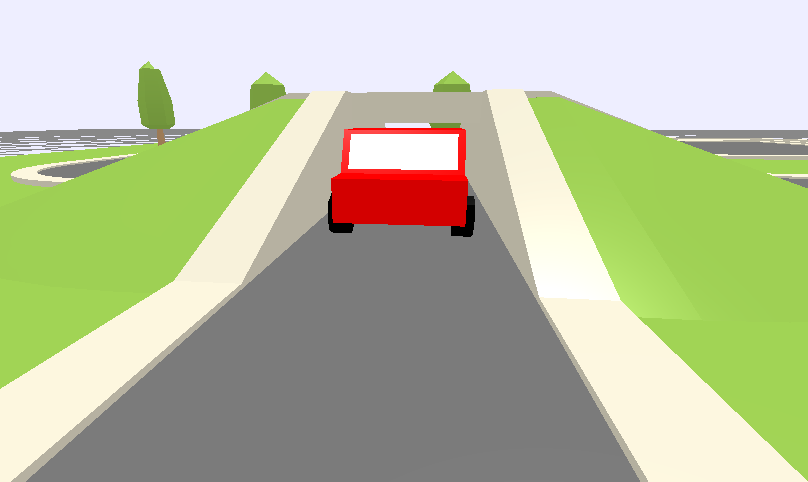

# Tile Universe Creator
Use this editor to build and create worlds! You can add roads, rivers, lakes and even mountains. Everything you create is saved automatically and you can import and export your worlds to create as many as you like!

Press **PLAY** to explore your world! If you have some road tiles, a car will appear and drive around!

[See below for help with the view and editting controls](#view-controls)

## Examples
There are already several examples of maps that you can import and start playing with right away. Visit the **[examples directory](examples/)** in the source code to download them and get started.

## View Controls
Click and drag your mouse while clicking the

* **left button** to rotate the view
* **middle button** to zoom the view (or use the mousewheel)
* **right button** to pan the view

## Editting Controls
Use the buttons in the bottom right corner of the screen to modify the **selected** tile.

You can hover over each button in the interface to see its corresponding keyboard shortcut.

Here are a few common ones for your convenience:

### Keyboard Shortcuts

* **Ctrl-z** - undo
* **Ctrl-Shift-z** - redo
* **d** - duplicate selected tile
* **k** - move up (hold **shift** to move up faster) selected tile
* **j** - move down (hold **shift** to move down faster) selected tile
* **r** - rotate selected tile
* **d**/**Del** - delete selected tile
* **arrow keys** - move the selected tile horizontally (hold **shift** and **ctrl** for broader and finer control)

