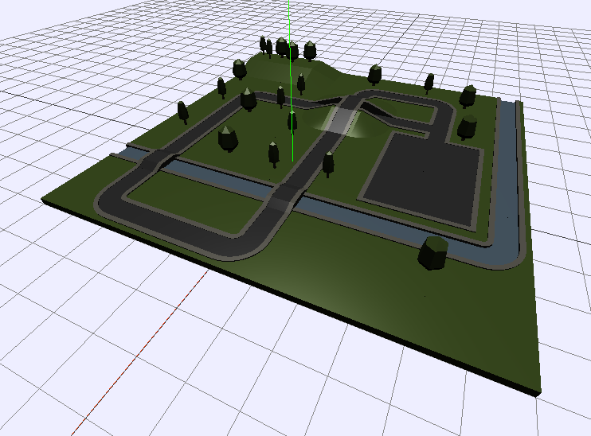
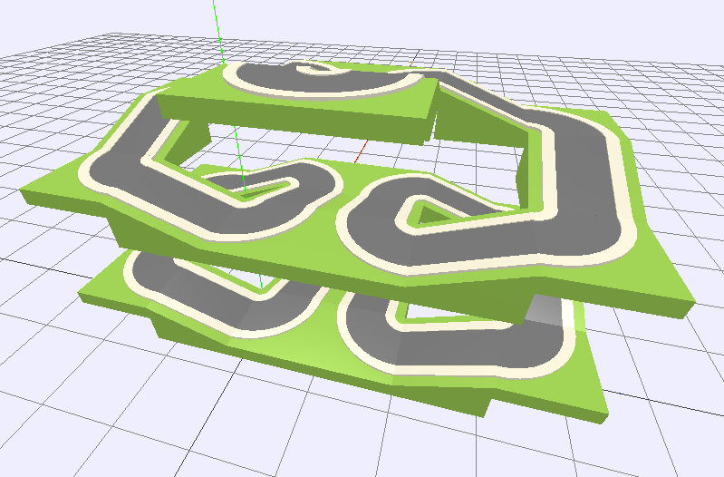
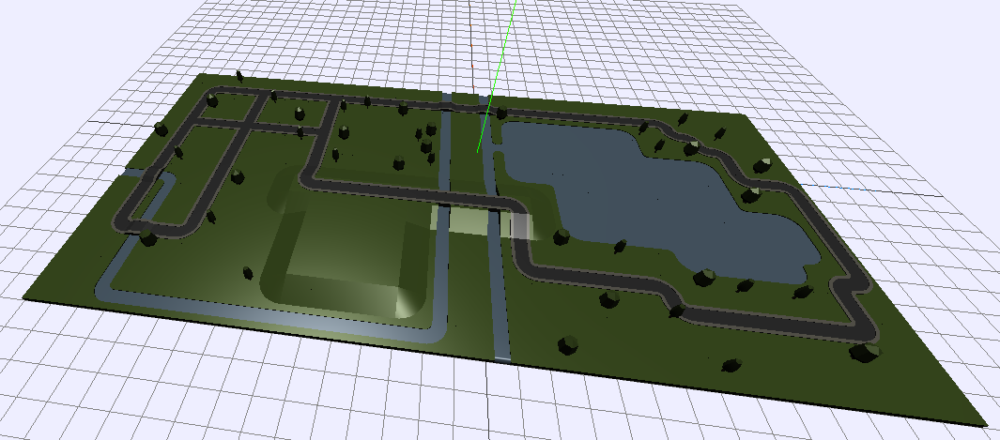

# Examples
To use these examples, follow these steps:

1. Download the example you want by clicking on its `.json` file, then clicking the "Raw" button and saving the file to your computer, usually with Ctrl-S
2. Go to the editor: http://sunjay.github.io/tile-universe/
3. Click "Import"
4. Select the previously downloaded file

Your file should load into the editor and **replace** whatever was there previously.

## Previews
### park.json

### tripleloop.json

### biglake.json

